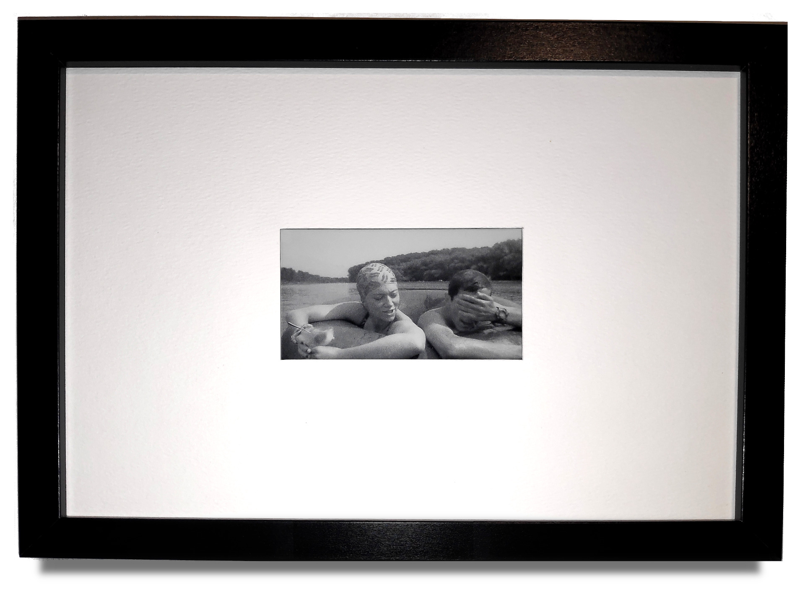

# Very Slow Movie Player

I was inspired by [this article](https://debugger.medium.com/how-to-build-a-very-slow-movie-player-in-2020-c5745052e4e4) which was inspired by [that article](https://medium.com/s/story/very-slow-movie-player-499f76c48b62) to build a VSMP.   However, I was put off by the cost of the hardware used in the original designs.
Eventually found the LILYGO® TTGO T5-4.7 Inch E-paper ESP32 dev board which was cheap and easy to use, at the cost of settling for a smaller display.
This repo includes the arduino sketch with some supporting info for making your own.


See photos folder for more photos.

## Features

- Long battery life
  Uses deep sleep for efficient power use (actual battery life depends on the battery used)
- Resilient
  The displayed frame position is saved to the SD card from time to time so playback can continue where it stopped after a reset or power loss
- Adaptive drawing
  A special drawing procedure is used for dark frames for improved visual quality
- Self contained
  Does not require a network connection or running a server
- Large capacity
  Can hold hundreds of thousends of pictures (depending on the capacity of SD card used)
- Playlist support
  Prepare a card with multiple movies by putting each one in a separate folder. They will be played by order one after the other

## Using

1. Setup your machine for development - see the instructions from [here](https://github.com/Xinyuan-LilyGO/LilyGo-EPD47)
1. Search for the esp32 (by Espressif Systems) library in the boards manager and install it
1. Install the [LilyGoEPD47 library](https://github.com/Xinyuan-LilyGO/LilyGo-EPD47)
1. Install the [PCF8563 library](https://github.com/lewisxhe/PCF8563_Library)
1. Install [JPEGDEC library](https://github.com/bitbank2/JPEGDEC)
1. Configure the [appropriate board parameters](https://t5-47-t5-47-plus.readthedocs.io/en/latest/get-started/index.html#compile-on-arduino) (based on the T5 board used)
1. Adjust the configuration parameters at the top of the sketch file to your liking
1. Upload the sketch to the board
1. Prepare an SD card with the desired movies - see instructions below
1. Insert the SD card to the built-in reader
1. Connect a battery
1. Very slow playback of the movies will start
1. Put it somewhere nice and enjoy

## Development

In the main source file, there is a `#define DEBUG` line you can uncomment to make the screen refresh quicker.
There is also a `BOARD_TYPE` configuration for the display type used for your project. The pin configurations will be different for each board.

The board will often go into deep sleep while you are trying to flash it, to force it to go into DFU mode, hold the `STR_IO0` button and press the `REST` button
(or plug in the board at the same time)

## Generating the images

### TL;DR
In the `scripts` folder there are a couple of bash scripts that:
- Extract frames from video
- Apply color corrections
- Remove blank frames

You can use them like so:

```bash
$ scripts/01_extract.sh video.file.name.mp4 00:24 02:01:07
$ scripts/02_clean.sh
$ scripts/03_resequence.sh
```

### More details
The firmware looks for frames named with a specific pattern, in folders under the root of the SD card file system.
For example: `/movie_a/000001.jpg`, `/movie_a/000002.jpg`, `/movie_a/000003.jpg` etc.
The files have to be named sequentially with no gaps and use 6 digits, zero-padded numbers.

The JPEG decoder expects a grayscale color space and _no progressive_ encoding.

These commands worked for me on a Linux system, using `ffmpeg` (version 4.2.4) and `imagemagick` (version 6.9.10):

```bash
# In the directory that contains the video file
mkdir frames

# Use ffmpeg to:
# - Extract frames as files with proper names
# - Scale and crop to 960x540 pixels
# - Apply curves adjustment
$ ffmpeg -ss 00:24 -to 02:01:07 -i video.file.name.mp4 -vf "scale=-2:540,crop=960:540,eq=saturation=0,lutrgb='r=clipval:g=clipval:b=clipval',curves=all='0/0 0.06/0.23 0.13/0.41 0.200/0.55 0.37/0.70 0.63/0.84 1/1'" -r 1 -qscale:v 2 frames/%06d.jpg

# Use mogrify from imagemagick
# to apply a grayscale colorspace for the frames
$ mogrify -colorspace Gray -quality 90 frames/*.jpg
```

Note the use of curves filter for improved quality when displayed on the e-ink screen.

#### Mac

```bash
$ brew install ffmpeg
$ brew install imagemagick
$ brew install ghostscript
```

## BOM (2024)

- [LILYGO® TTGO T5-4.7 Plus](https://www.aliexpress.us/item/3256802803613744.html)
- 3.7v Li-Po battery (the larger the better), [example](https://www.aliexpress.us/item/2251832696873453.html)
- A picture frame
- Some foam board for mounting the display in the picture frame

Total cost: about $60

## BOM (2021)

- [LILYGO® TTGO T5-4.7](https://www.aliexpress.com/item/1005002006058892.html)
- [SD card module](https://www.aliexpress.com/item/1005002317501092.html)
- 3.7v Li-Po battery (the larger the better), [example](https://www.aliexpress.com/item/4001116123943.html)
- A picture frame
- Some foam board for mounting the display in the picture frame

Total cost: about $65

## Battery life
With a 6Ah battery and 150 seconds between frame changes:
- 19.5 days to "battery low" indicator
- 20.5 days to battery dead
- 7 hours charging to a full battery

## Future plans
Make it work with a bigger screen!
There are available unexpensive displays that could be used (EG ED060XC3), but I still don't know how to drive them with available hardware.
